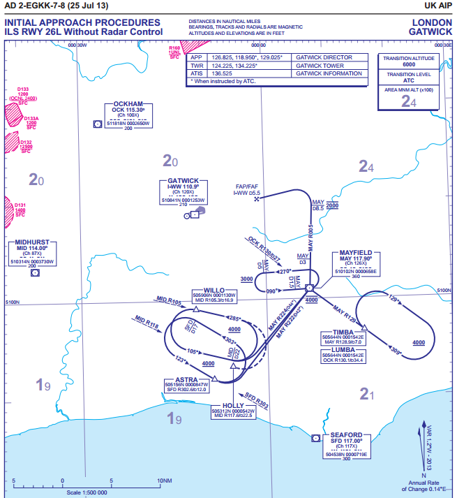
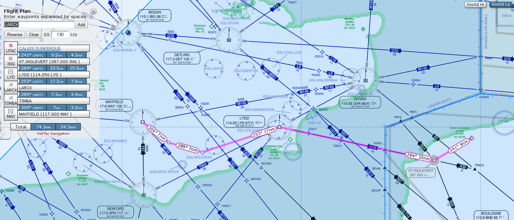
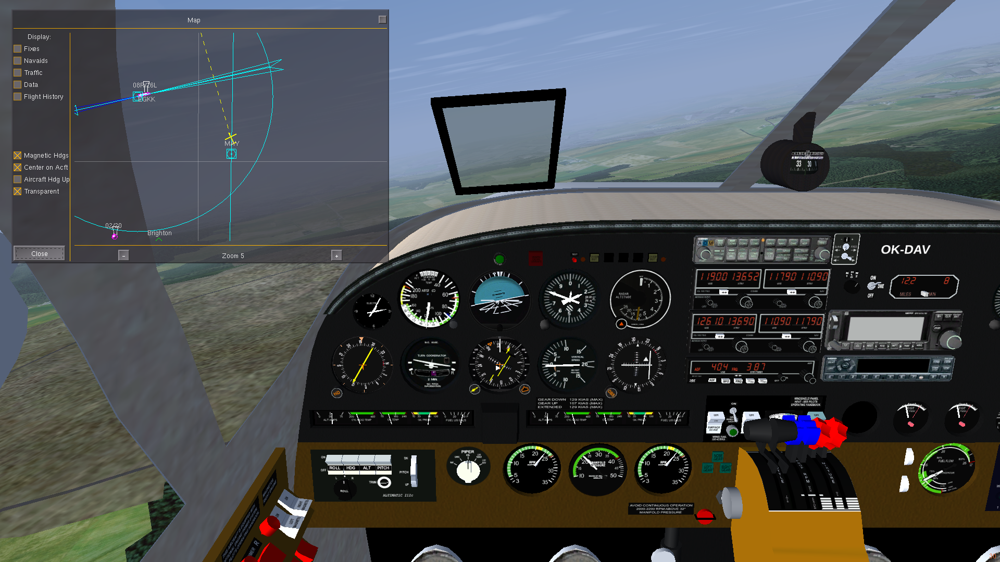
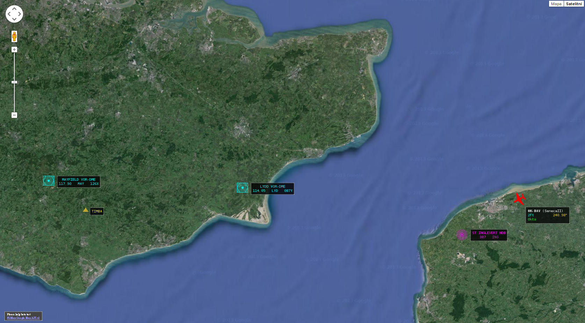
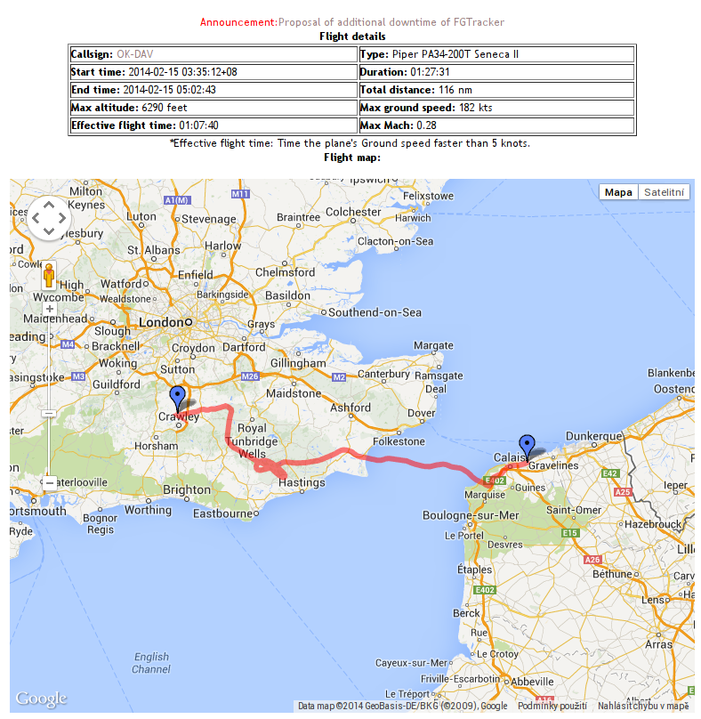

Calais - Gatwick
================

2014-02-15

Today, I was training cross-country virtual flight under
[IFR](http://en.wikipedia.org/wiki/Instrument_flight_rules) from
[LFAC](http://en.wikipedia.org/wiki/Calais%E2%80%93Dunkerque_Airport)
Calais–Dunkerque Airport, France to
[EGKK](http://en.wikipedia.org/wiki/Gatwick_Airport) Gatwick Airport, United
Kingdom. I was flying my favourite [Piper PA-34 Seneca
II](http://en.wikipedia.org/wiki/Piper_PA-34_Seneca#PA-34-200T_Seneca_II) in
[FlightGear](http://www.flightgear.org/) v2.12.1. This post summarises
the virtual flight preparation.

I started by looking at Gatwick approach charts. As I am not using GPS, I
needed approach charts usable for VOR/DME. I printed out two of them -
"INITIAL APPROACH PROCEDURES (ILS RWY 08R WITHOUT RADAR CONTROL)" and "INITIAL
APPROACH PROCEDURES (ILS RWY 26L WITHOUT RADAR CONTROL)" to be prepared for
approaching both from east and west, depending on the actual wind and runway in
use. Charts can be found in the
[charts.aero](https://charts.aero/airport/EGKK) database.

I knew I would be coming from east so I picked TIMBA as the [initial approach
fix](http://en.wikipedia.org/wiki/Initial_approach_fix). The next step was to
plan arriving to TIMBA. This is when
[STAR](http://en.wikipedia.org/wiki/Standard_Terminal_Arrival_Route_(STAR\))
charts become useful. I printed out "STAR VIA TIMBA (NORTH AND EAST)"
and picked the TIMBA TWO FOXTROT (TIMBA 2F) arrival route. So I realized I need
to get to the LYD VOR/DME station.

At this point, the Skyvector.com came to help. I was happy to find ST.INGLEVERT
(387 ING) NDB station near the Calais airport and so I planned to cross the
Channel via the airway L15 by flying heading 284 outbound from ING. Getting to
ING should be easy as it is located directly in the runway heading, just 9
miles away from the Calais airport.

Hoping to enjoy the scenery of [White Cliffs of
Dover](http://en.wikipedia.org/wiki/White_Cliffs_of_Dover), I decided to fly
at [flight level](http://en.wikipedia.org/wiki/Flight_level) FL70 which is also
the minimal level at TIMBA.

So now, the whole flight plan read like this:

* After take-off, continue runway heading towards NDB ING, climb and maintain
  7000 feets.
* At ING, turn right and continue tracking outbound on the 284 bearing using
  [NDB navigation](http://www.navfltsm.addr.com/howitbegan.htm).
* When above the Channel, switch to using [VOR
  navigation](http://www.navfltsm.addr.com/vor-nav.htm) and continue flying on
  the 284° radial (R284) towards VOR LYD.
* At LYD, turn left and continue on radial 253° from LYD.
* When DME shows 17 miles away from LYD, enter the holding pattern. Turn right
  to intercept MAY VOR R129 to TIMBA.
* When established inbound in the holding pattern, descend to 4000 and proceed
  to MAY VOR.
* Leave MAY VOR on R005 descending to 2000.
* At MAY D8.5 (8.5 miles away from MAY DME) turn left to intercept the ILS
  localiser and continue ILS approach.

The whole flight plan can be seen at
[Skyvector.com](http://skyvector.com/?ll=50.94550738515982,0.2616577084356982&chart=302&zoom=3&plan=A.LF.LFAC:N.LF.ING:V.EG.LYD:F.EG.TIMBA:V.EG.MAY).

It was supposed to be quite a nice training session combining NDB navigation,
VOR navigation, flying the holding pattern and ILS approach. Unfortunately,
there was quite a strong side wind today and the visibility was not that good
with clouds at 1000. The ATIS in Calais reported wind 170° at 19 knots and it
was 170° at 28 knots in Gatwick. So tracking the beam was quite challenging,
beside the fact that I was just using my new trimming wheel for the first
time. Anyway, I landed after an hour or so of the flight - and that is what
counts.

